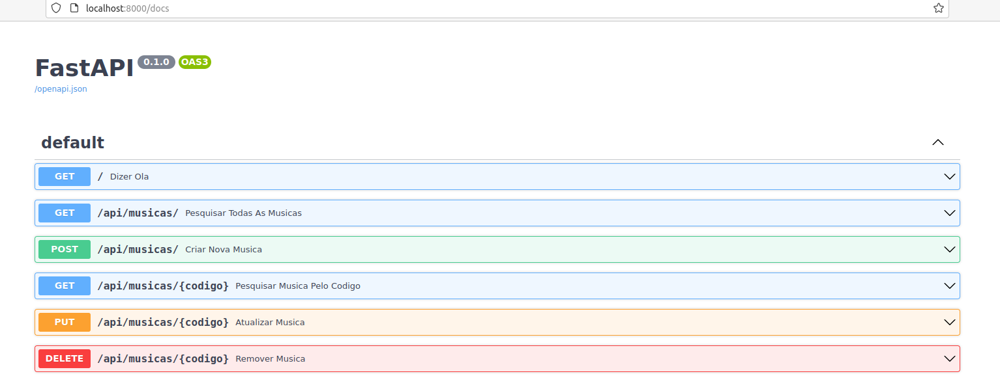

# Etapa 9

Documentação OpenAPI.

## Instruções da etapa

A [Especificação OpenAPI](https://swagger.io/specification/), também conhecida como
documentação Swagger, padroniza uma _interface_ ou documentação para as 
APIs RESTful. Assim, ela é usada para descrever e apresentar as APIs da aplicação para que
outros possam saber como testá-las ou utilizá-las em aplicações _clientes_.

Neste projeto iremos usar apenas o nome Swagger; por exemplo, documentação Swagger.

Para cada API criada neste projeto, gere a documentação Swagger dela, descrevendo-a,
identificando suas entradas e saídas. Também, tente descrever cada objeto, registro
e resposta da API. 

Por exemplo, na API de criação de música, nós informamos como entrada um registro de 
música com três campos, sendo que um é opcional. Na resposta de sucesso, respondemos com
código HTTP [201](https://developer.mozilla.org/pt-BR/docs/Web/HTTP/Status/201)
(Criado/_Created_) e com um registro informando o código da nova música. Mas, se há
uma música com o mesmo nome, nós respondemos com o código HTTP 
[409](https://developer.mozilla.org/pt-BR/docs/Web/HTTP/Status/409)
(Conflito/_Conflict_).


## Como fazer?

Nesta etapa, também **não** não a completaremos; somente vamos documentar a API
principal e a API de cadastro de uma nova música.

### Criando o documento Swagger/OpenAPI

Nativamente o FastAPI já trabalha e gera o documento Swagger, o que ele chama
em sua documentação de 
[Documentos interativos de API](https://fastapi.tiangolo.com/tutorial/first-steps/#interactive-api-docs).

Se nós já iniciarmos a nossa aplicação:

```sh
uvicorn musicas.aplicacao:app
```

e acessarmos 

> http://localhost:8000/docs

Nós veremos que o documento Swagger já está gerado




Somente falta rever e enriquecer a documentação, tal como descrito na documentação 
do [FastaAPI](https://fastapi.tiangolo.com/tutorial/first-steps/#openapi).

No arquivo [rest_conf.py](./musicas/rest/rest_conf.py) informamos o título e
uma versão, que escolhemos as etapas de nosso projeto para ser a nossa versão.

Em seguida, ajustamos a documentação da rota principal no arquivo 
[principal_rest.py](./musicas/rest/principal_rest.py).

Já em [modelos.py](./musicas/modelos.py), revisamos e ajustamos os modelos 
para _documentar_ com o Swagger, tal como adicionar 
[exemplos](https://fastapi.tiangolo.com/tutorial/schema-extra-example/).

E _documentamos_ e ajustamos algumas funções
de [musicas_rest.py](./musicas/rest/musicas_rest.py), mas somente
focalizamos na função de criar uma nova música. Nela por exemplo,
informamos alguns dos código de 
[retorno HTTP](https://fastapi.tiangolo.com/advanced/additional-responses/).


## Testando

Suba a aplicação FastAPI (Se não lembra, consulte as etapas anteriores).

Acesse a documentação Swagger:

> http://localhost:8000/docs

Lembrem-se que _focamos_ apenas nestas para _documentar_:


> http://localhost:8000/docs#/Principal/dizer_ola__get

e 

> http://localhost:8000/docs#/M%C3%BAsicas/criar_nova_musica_api_musicas__post