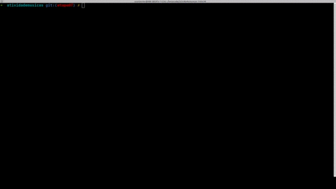
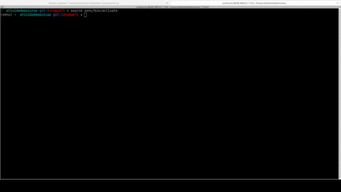
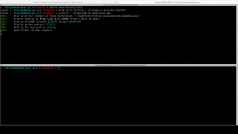
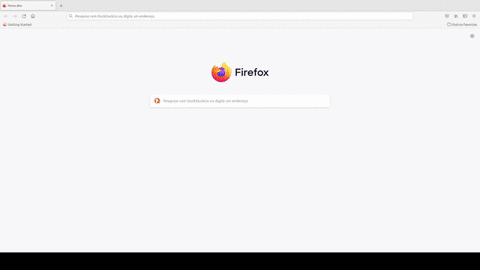

# Etapa 7

Testes manuais.

## Instruções da etapa

Testes sua aplicação FastAPI manualmente, podendo usar o arquivo
[musicas.http](./extras/api/musicas.http) ou o esboço de 
[frontend](./extras/frontend/).

## Como fazer?

Nós fizemos estes testes em um ambiente Linux com Python 3.9.

- [Vídeo 1](./extras/videos/v1-instalapacotes.mp4): Instalando o ambiente virtual e os pacotes.

- [Vídeo 2](./extras/videos/v2-dockerbanco.mp4): Subindo o Docker do banco de dados.

- [Vídeo 3](./extras/videos/v3-servidorfastapi.mp4): Subindo o servidor FastAPI.

- [Vídeo 4](./extras/videos/v4-servidorfrontend.mp4): Subindo o _servidor_ do Front End.

- [Vídeo 5](./extras/videos/v5-testefrontend.mp4): Testando as APIs com Front End, por 
pesquisar todos, criar uma nova música, pesquisar por código, editar a música, e remover a música.

